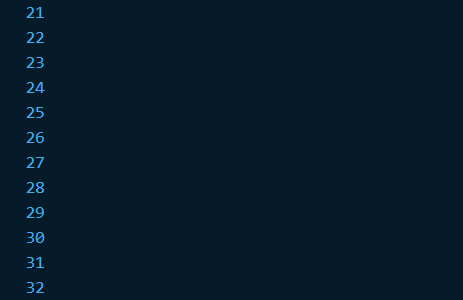
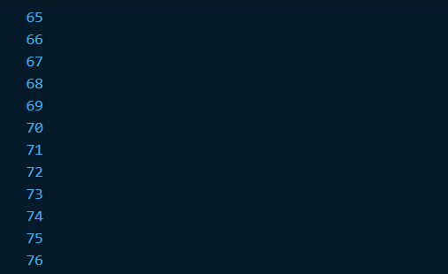
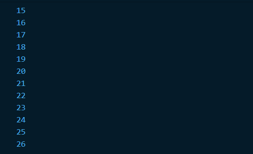
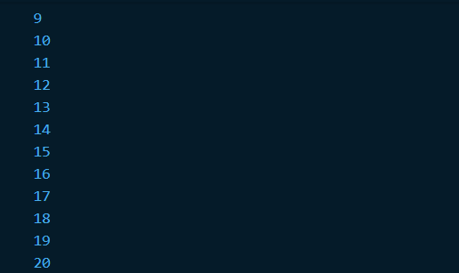
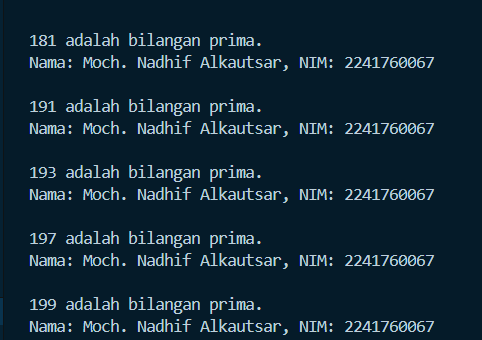
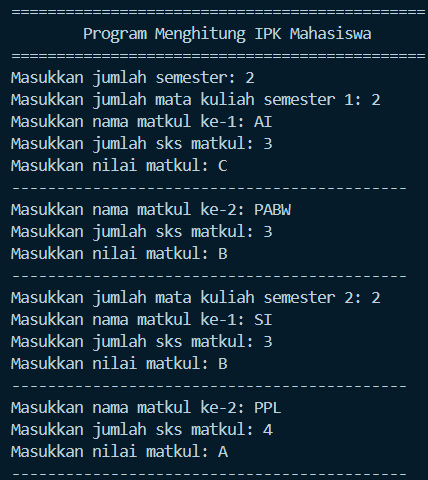
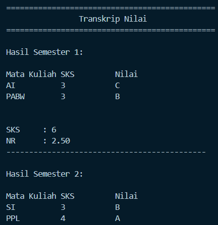

# Jobsheet 3
Nama    : Moch. nadhif Alkautsar
NIM     : 2241760067
Kelas   : SIB 3D
Absen   : 20

## Praktikum 1
1. String test = "true";
    if (test == "true") {
        print("Kebenaran");
    } else if (test == "test2") {
        print("Test2");
    } else {
        print("Something else");
    }

    if (test == "true") print("Kebenaran");

    Hasil
    

## Praktikum 2
1. // while
    while (counter < 33){
        print(counter);
        counter++;
    }

    Hasil
    

2. // do-while
    do {
        print(counter);
        counter++;
    } while (counter < 77);

    Hasil
    

## Praktikum 3
var index;
1. // for
    for (index = 10; index < 27; index++){
        print(index);
    }

  Hasil
  

2. // for-break  
    for (index = 1; index < 30; index++){
        if (index == 21) break;
        else if (index > 1 && index < 7)continue;
        print(index);
    }

    Hasil
    

## Tugas Praktikum
    // tugas praktikum
    void main(){
        String namaLengkap = 'Moch. Nadhif Alkautsar';  
        String nim = '2241760067';  
  
        for (int i = 0; i <= 201; i++) {
            if (isPrime(i)) {
                print('$i adalah bilangan prima.');
                print('Nama: $namaLengkap, NIM: $nim\n');
            }
        }
    }

    bool isPrime(int number) {
        if (number < 2) {
            return false;
        }
        for (int i = 2; i <= number ~/ 2; i++) {
            if (number % i == 0) {
            return false;
        }
    }
    return true;
    }

    Hasil

## Tugas 2
Hasil

